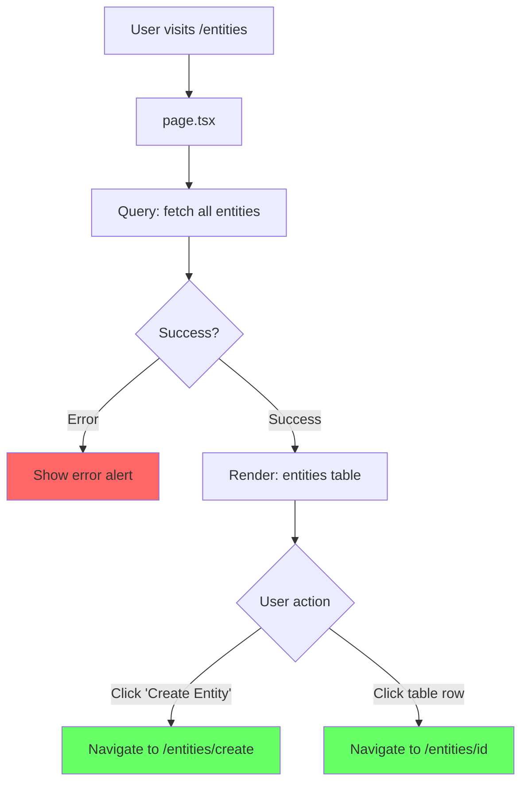

# Entities List - Page Flow

> URL: `/entities`

---

## User Journey

---

## Flow Summary

| Step | URL         | Query              | Component      |
| ---- | ----------- | ------------------ | -------------- |
| 1    | `/entities` | fetch all entities | Entities table |

---

## Data Queries

- **Entities**: id, name, description, fields, timestamps

---

## Edge Cases

| Scenario          | Handling                 |
| ----------------- | ------------------------ |
| Query fails       | Show error alert         |
| No entities exist | Show empty state message |
