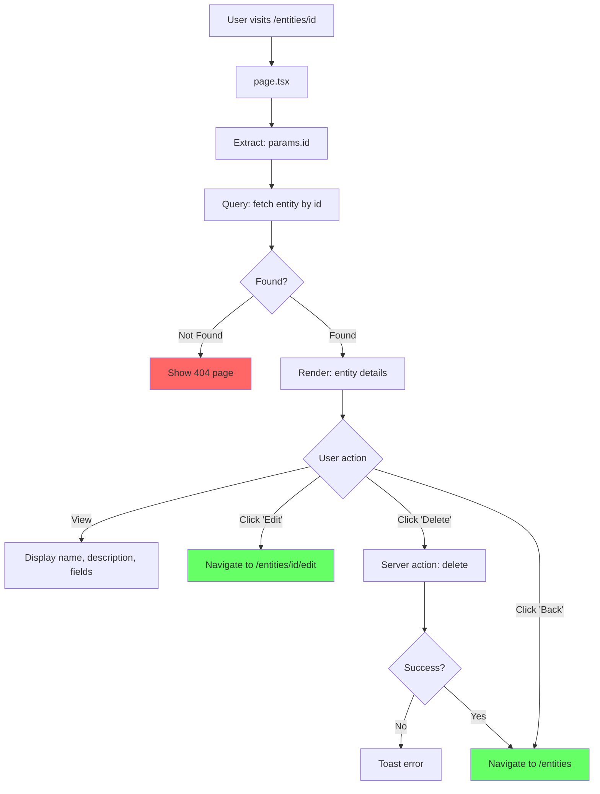

# Entity Details - Page Flow

> URL: `/entities/{id}`

---

## User Journey

---

## Flow Summary

| Step | URL              | Query              | User Actions       |
| ---- | ---------------- | ------------------ | ------------------ |
| 1    | `/entities/{id}` | fetch entity by id | View, Edit, Delete |

---

## Data Queries

- **Entity**: id, name, description, fields (Record<key, FieldSchema>), timestamps

---

## Edge Cases

| Scenario         | Handling                  |
| ---------------- | ------------------------- |
| Entity not found | Show 404 page             |
| Query fails      | Show 404 page             |
| Delete fails     | Toast error, stay on page |
