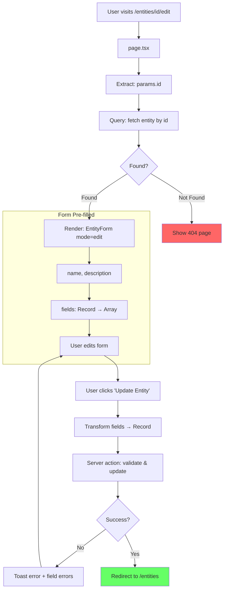

# Edit Entity - Page Flow

> URL: `/entities/{id}/edit`

---

## User Journey

---

## Flow Summary

| Step | URL                   | Query              | User Action   |
| ---- | --------------------- | ------------------ | ------------- |
| 1    | `/entities/{id}/edit` | fetch entity by id | Edit & submit |
| 2    | `/entities`           | —                  | —             |

---

## Data Queries

- **Entity**: id, name, description, fields (Record<key, FieldSchema>), timestamps

---

## Differences from Create Mode

| Aspect        | Create          | Edit             |
| ------------- | --------------- | ---------------- |
| `mode` prop   | `"create"`      | `"edit"`         |
| `initialData` | Not provided    | Existing entity  |
| Form defaults | Empty           | Pre-filled       |
| Fields list   | Empty           | From entity data |
| Submit action | create entity   | update entity    |
| Button text   | "Create Entity" | "Update Entity"  |

---

## Edge Cases

| Scenario                | Handling                                       |
| ----------------------- | ---------------------------------------------- |
| Entity not found        | Show 404 page                                  |
| Remove all fields       | Validation error "At least one field required" |
| Duplicate field labels  | Auto-generates unique key                      |
| Server validation fails | Toast error + field errors                     |
