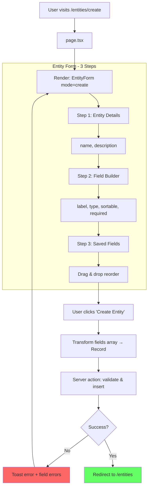

# Create Entity - Page Flow

> URL: `/entities/create`

---

## User Journey

---

## Flow Summary

| Step | URL                | Query | User Action                   |
| ---- | ------------------ | ----- | ----------------------------- |
| 1    | `/entities/create` | None  | Fill name, add fields, submit |
| 2    | `/entities`        | —     | —                             |

---

## Data Transformation

Fields array in form → Record<key, FieldSchema> for DB:

- Key generated from `toSnakeCase(label)`
- Order set from array index

---

## Edge Cases

| Scenario                | Handling                                        |
| ----------------------- | ----------------------------------------------- |
| No fields added         | Validation error "At least one field required"  |
| Duplicate field labels  | Auto-generates unique key: `field_1`, `field_2` |
| Server validation fails | Toast error + attach field errors to form       |
