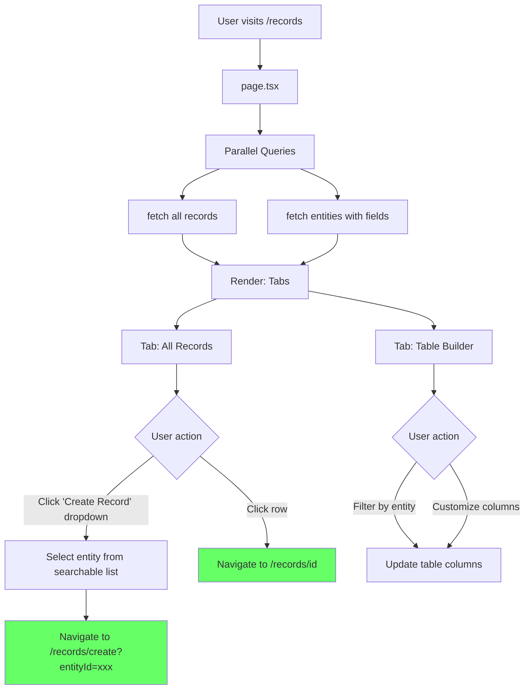

# Records List - Page Flow

> URL: `/records`

---

## User Journey

---

## Flow Summary

| Step | URL        | Query                                | Component                                    |
| ---- | ---------- | ------------------------------------ | -------------------------------------------- |
| 1    | `/records` | fetch records + entities in parallel | Records table, Table builder, CreateDropdown |

---

## Data Queries

- **Records**: All records with entity name, field values, metadata, timestamps
- **Entities**: All entities with field definitions (for dropdown + dynamic columns in table builder)

---

## Components

- **CreateRecordDropdown**: Searchable dropdown showing all entities, navigates to create page with entityId
- **RecordsTable**: Data table showing all records
- **TableBuilder**: Dynamic table with entity-specific column configuration

---

## Edge Cases

| Scenario             | Handling                                   |
| -------------------- | ------------------------------------------ |
| Records query fails  | Show error alert                           |
| Entities query fails | Show error alert, hide create dropdown     |
| No entities exist    | Show "Create Entity First" button          |
| No records exist     | Show empty state with "Create Record" link |
