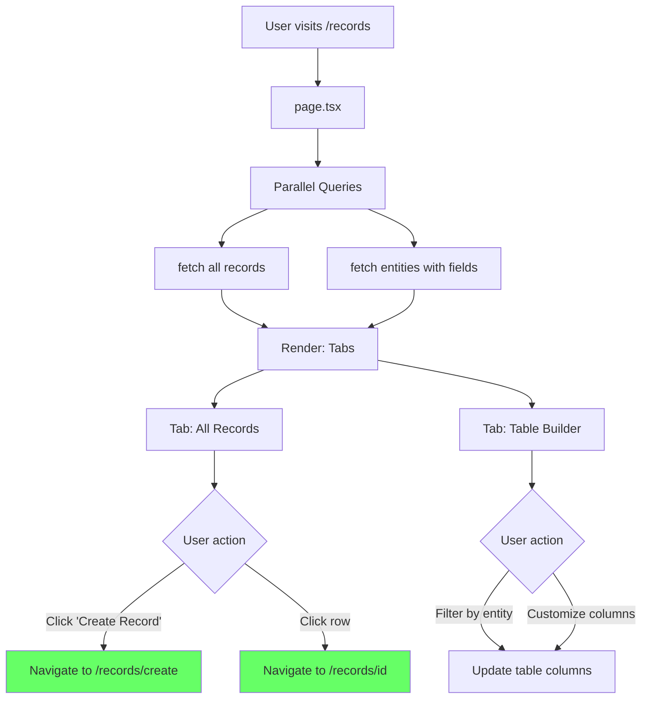

# Records List - Page Flow

> URL: `/records`

---

## User Journey

---

## Flow Summary

| Step | URL        | Query                                | Component                    |
| ---- | ---------- | ------------------------------------ | ---------------------------- |
| 1    | `/records` | fetch records + entities in parallel | Records table, Table builder |

---

## Data Queries

- **Records**: All records with entity name, field values, metadata, timestamps
- **Entities**: All entities with field definitions (for dynamic columns in table builder)

---

## Edge Cases

| Scenario             | Handling                                  |
| -------------------- | ----------------------------------------- |
| Records query fails  | Show error alert                          |
| Entities query fails | Show error alert                          |
| No records exist     | Show empty state with "Create Record" CTA |
