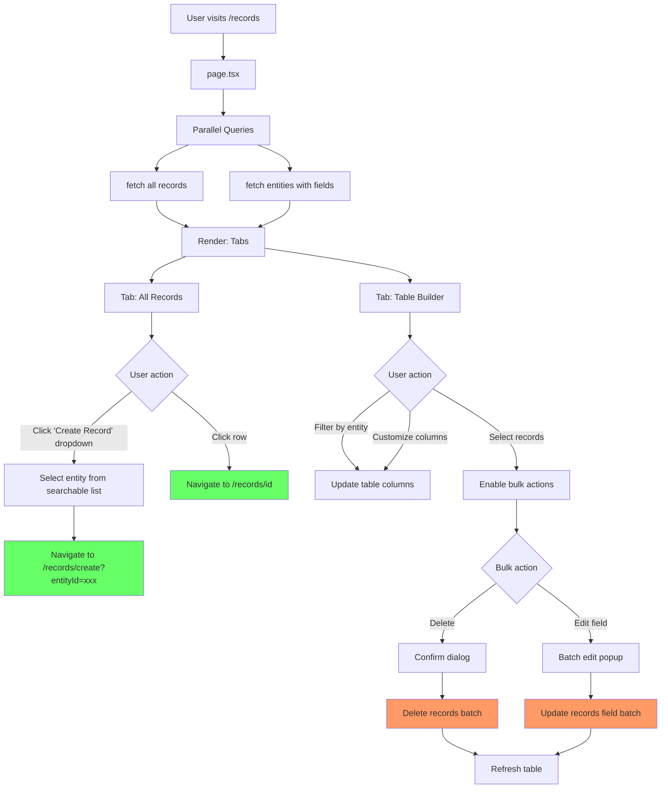

# Records List - Page Flow

> URL: `/records`

---

## User Journey

---

## Flow Summary

| Step | URL        | Query                                | Component                                                 |
| ---- | ---------- | ------------------------------------ | --------------------------------------------------------- |
| 1    | `/records` | fetch records + entities in parallel | Records table, Table builder, CreateDropdown, BulkActions |

---

## Data Queries

- **Records**: All records with entity name, field values, metadata, timestamps
- **Entities**: All entities with field definitions (for dropdown + dynamic columns in table builder)

---

## Components

- **CreateRecordDropdown**: Searchable dropdown showing all entities, navigates to create page with entityId
- **RecordsTable**: Data table showing all records
- **TableBuilder**: Dynamic table with entity-specific column configuration + row selection
- **BulkActionsToolbar**: Toolbar showing selected count with bulk delete and batch edit buttons
- **BatchEditDialog**: Popup form for editing a single field value across selected records

---

## Bulk Actions (Table Builder)

### Row Selection

- Checkbox column for selecting individual records
- "Select all" checkbox in header for current page
- Selection count displayed in toolbar

### Bulk Delete

- Confirmation dialog showing count of records to delete
- Atomic batch delete using transaction
- Max 100 records per batch

### Batch Edit Field

1. Select field from dropdown (sorted by order)
2. Enter new value with type-appropriate input
3. Confirmation dialog before applying
4. Atomic batch update using transaction

---

## Edge Cases

| Scenario             | Handling                                   |
| -------------------- | ------------------------------------------ |
| Records query fails  | Show error alert                           |
| Entities query fails | Show error alert, hide create dropdown     |
| No entities exist    | Show "Create Entity First" button          |
| No records exist     | Show empty state with "Create Record" link |
| Bulk delete fails    | Show error toast, preserve selection       |
| Batch edit fails     | Show error toast, preserve selection       |
| Required field empty | Validation error before confirmation       |
| Invalid enum value   | Validation error from server               |
