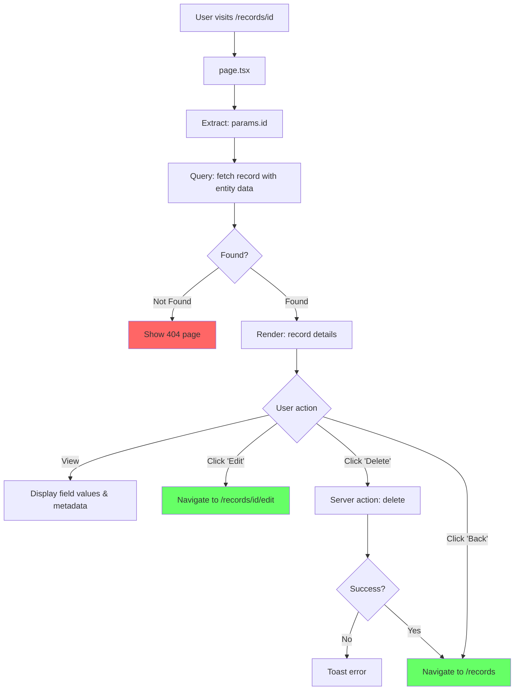

# Record Details - Page Flow

> URL: `/records/{id}`

---

## User Journey

---

## Flow Summary

| Step | URL             | Query                           | User Actions       |
| ---- | --------------- | ------------------------------- | ------------------ |
| 1    | `/records/{id}` | fetch record with entity fields | View, Edit, Delete |

---

## Data Queries

- **Record**: id, entityId, entityName, entityFields, fieldValues, metadata, timestamps

---

## Edge Cases

| Scenario         | Handling                  |
| ---------------- | ------------------------- |
| Record not found | Show 404 page             |
| Query fails      | Show 404 page             |
| Delete fails     | Toast error, stay on page |
