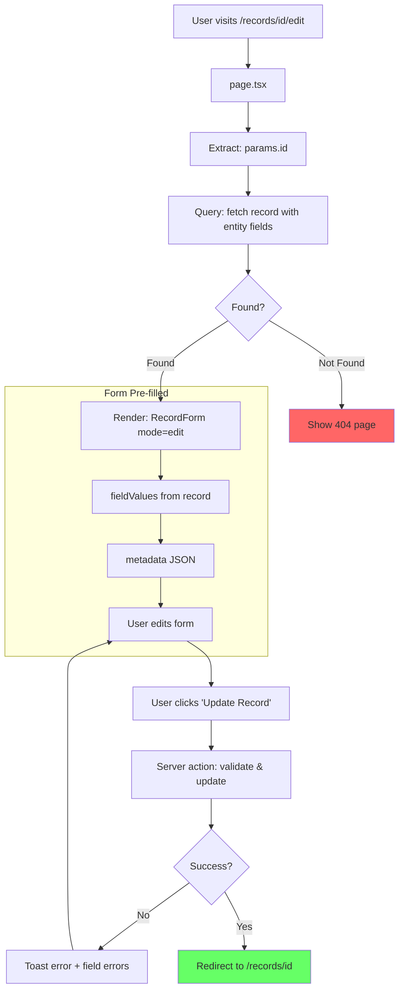

# Edit Record - Page Flow

> URL: `/records/{id}/edit`

---

## User Journey

---

## Flow Summary

| Step | URL                  | Query                           | User Action   |
| ---- | -------------------- | ------------------------------- | ------------- |
| 1    | `/records/{id}/edit` | fetch record with entity fields | Edit & submit |
| 2    | `/records/{id}`      | —                               | —             |

---

## Data Queries

- **Record**: id, entityId, entityName, entityFields, fieldValues, metadata, timestamps

---

## Differences from Create Mode

| Aspect          | Create               | Edit            |
| --------------- | -------------------- | --------------- |
| `mode` prop     | `"create"`           | `"edit"`        |
| `initialData`   | Not provided         | Current record  |
| Form defaults   | Empty/default values | Pre-filled      |
| Submit action   | create record        | update record   |
| Cancel goes to  | `/records`           | `/records/{id}` |
| Success goes to | `/records/{id}`      | `/records/{id}` |

---

## Edge Cases

| Scenario            | Handling                  |
| ------------------- | ------------------------- |
| Record not found    | Show 404 page             |
| Entity deleted      | Show 404 page             |
| Validation fails    | Show field errors         |
| Update action fails | Toast error, stay on page |
