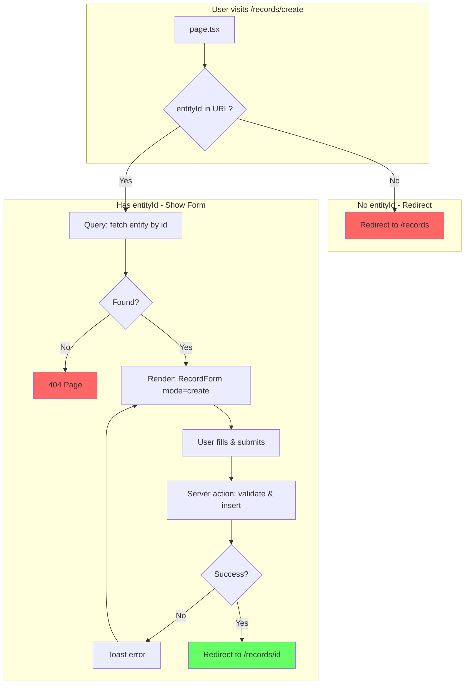

# Create Record - Page Flow

> URL: `/records/create?entityId={id}`

---

## User Journey

---

## Flow Summary

| Step | URL                            | Condition      | Query              | User Action   |
| ---- | ------------------------------ | -------------- | ------------------ | ------------- |
| 1    | `/records/create`              | No `entityId`  | —                  | Redirect      |
| 2    | `/records/create?entityId=xxx` | Has `entityId` | fetch entity by id | Fill & submit |
| 3    | `/records/{id}`                | After submit   | —                  | —             |

---

## Data Queries

- **Single entity** (id, name, fields) for dynamic form generation

---

## Notes

- Entity selection is now done via dropdown on `/records` page
- Direct access to `/records/create` without entityId redirects to `/records`

---

## Edge Cases

| Scenario              | Handling                        |
| --------------------- | ------------------------------- |
| No `entityId`         | Redirect to /records            |
| Invalid `entityId`    | Show 404 page                   |
| Form validation fails | Show field errors, stay on page |
| Create action fails   | Toast error, stay on page       |
