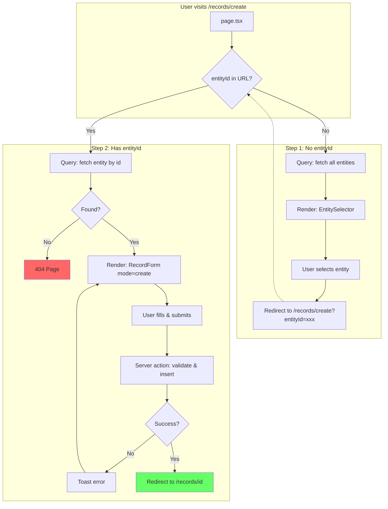

# Create Record - Page Flow

> URL: `/records/create` and `/records/create?entityId={id}`

---

## User Journey

---

## Flow Summary

| Step | URL                            | Condition      | Query              | User Action   |
| ---- | ------------------------------ | -------------- | ------------------ | ------------- |
| 1    | `/records/create`              | No `entityId`  | fetch all entities | Select entity |
| 2    | `/records/create?entityId=xxx` | Has `entityId` | fetch entity by id | Fill & submit |
| 3    | `/records/{id}`                | After submit   | —                  | —             |

---

## Data Queries

- **Step 1**: All entities (id, name, description) for selector
- **Step 2**: Single entity (id, name, fields) for dynamic form generation

---

## Edge Cases

| Scenario              | Handling                        |
| --------------------- | ------------------------------- |
| Entities query fails  | Show error card                 |
| No entities exist     | Show "Create Entity" prompt     |
| Invalid `entityId`    | Show 404 page                   |
| Form validation fails | Show field errors, stay on page |
| Create action fails   | Toast error, stay on page       |
